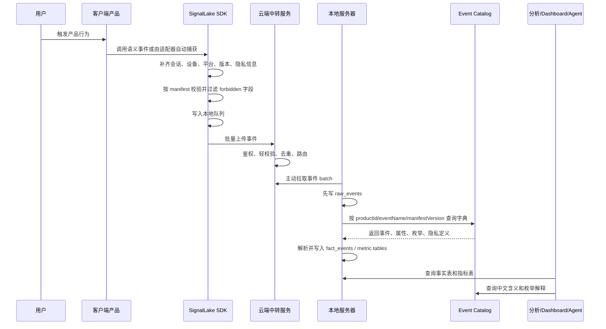

# SignalLake SDK 数据流、业务流与实现逻辑需求说明

日期：2026-07-04

## GoalFrame

objective: 将 SignalLake SDK 本轮需求讨论沉淀成中文文档，重点说明业务流、数据定义流、事件数据流、解析使用逻辑和多端 SDK 实现逻辑。

successCriteria:

- 说明产品行为如何变成结构化埋点事件。
- 说明埋点定义、事件字典、枚举字典应该放在哪里。
- 说明客户端、云端中转、本地服务器之间的数据流。
- 说明本地服务器如何根据字典解析、入库、计算、分析。
- 说明多端 SDK 应该采用什么技术架构。

constraints:

- SignalLake SDK 只负责采集、整形、校验、隐私过滤、缓存、上传和事件契约。
- 云服务器只做注册、中转、轻校验、路由和短期队列，不做最终分析平台。
- 本地服务器负责解析、入库、计算和数据分析。
- 默认不采集用户内容、文件路径、文件名、剪贴板内容、访问密钥、密码等敏感数据。

receiver: user / agent.signallake-sdk.product-manager

## 0. 团队评审导读

这份文档给团队评审时，建议先看本节，再看第 10、15、16、17、19、20 节。

一句话结论：

```text
SignalLake SDK 是一套多产品复用的埋点 SDK。
客户端负责集成 SDK 和声明关键行为语义。
SDK 负责自动采集、校验、隐私过滤、缓存和上传。
云端只负责注册、中转、轻校验和路由。
本地服务器负责解析、入库、计算和分析。
事件字典是全链路理解数据的核心。
```

团队需要评审的核心问题：

- 业务上：这套事件定义方式能不能支撑多个产品复用。
- 客户端上：各端接入 SDK 后需要改多少代码。
- 服务端上：云端中转和本地服务器边界是否清楚。
- 数据上：事件字典、枚举字典、raw_events、fact_events 是否足够支撑分析。
- 隐私上：默认禁止采集路径、文件名、内容、token 是否满足产品合规要求。
- 交付上：MVP 是否能先跑通闭环，而不是一开始做成大平台。

## 0.1 一页版业务链路

```text
产品用户行为
  -> 产品事件清单定义这个行为是什么意思
  -> 客户端集成 SDK 并绑定语义 ID
  -> SDK 自动生成标准事件
  -> SDK 本地校验、隐私过滤、缓存
  -> SDK 批量上传到云端中转
  -> 云端鉴权、轻校验、路由到对应本地服务器
  -> 本地服务器先写 raw_events
  -> 本地服务器按 Event Catalog 解析成 fact_events
  -> 本地计算活跃、留存、漏斗、错误率、功能使用率
  -> Dashboard / Agent / 分析人员按字典理解数据
```

## 0.2 端到端时序图



## 0.3 团队角色责任

| 角色 | 主要责任 | 不负责 |
| --- | --- | --- |
| SignalLake SDK | 事件信封、通用字段、枚举、隐私规则、校验、缓存、上传协议、多端 SDK | 业务指标口径、最终分析结论 |
| 产品 PM | 定义哪些用户行为值得分析、哪些漏斗/留存/功能使用率重要 | SDK 内部实现 |
| 客户端研发/Codex | 接入 SDK、绑定 screenId/commandId/objectId、维护产品 event manifest | 自己绕过 SDK 手写上报协议 |
| 云端服务 | 注册产品和 app、鉴权、轻校验、短期队列、路由到本地服务器 | 长期分析仓库、复杂计算 |
| 本地服务器 | Catalog DB、raw_events、fact_events、解析、计算、查询服务 | 客户端采集逻辑 |
| 数据分析/Agent | 基于字典解释数据、查询指标、输出分析 | 猜测未定义字段含义 |

## 0.4 业务目标与评审风险

业务目标：

- 多个产品能复用一套埋点语言。
- 客户端接入成本低，不需要每个行为都手写完整上报逻辑。
- 上报数据能被本地服务器稳定解析，而不是靠人猜字段。
- 数据默认隐私安全，不采集用户原始内容。
- 第一版能跑通端到端闭环，再逐步扩展平台和产品。

评审风险：

- 如果没有事件字典，后续数据分析会无法解释事件。
- 如果云端做得太重，会破坏“云端中转、本地分析”的私有化链路。
- 如果默认采集原始点击和文本，会带来隐私风险和低质量数据。
- 如果各端自己定义字段和枚举，未来多产品数据无法合并分析。
- 如果 MVP 一开始覆盖所有平台，交付风险会明显升高。

## 1. 项目定位

SignalLake SDK 要解决的是多个产品共用的数据埋点问题。

目标不是做一个很重的大数据平台，而是做一个轻量、可复用、多端可接入的埋点 SDK。客户端集成后，SDK 能把产品行为结构化地上报出去，后续再由云端中转、本地服务器解析、计算和分析。

最终形态：

```text
客户端产品集成 SignalLake SDK
  -> SDK 自动采集和生成结构化事件
  -> 事件通过云服务器中转
  -> 本地服务器接收事件
  -> 本地服务器按事件字典解析、入库、计算、分析
```

SignalLake SDK 不负责：

- 数据仓库完整建设
- 大数据计算平台
- BI 仪表盘
- Agent 问数产品
- 业务指标口径
- 产品专属分析结论

这些属于下游本地数据平台、分析系统或 Agent。

## 2. 核心设计原则

自动埋点不等于“把所有点击都采下来，然后以后再猜”。

正确方式是：

```text
SDK 通用规则
  + 产品事件清单
  + 平台自动采集能力
  + 语义化行为 ID
  -> 可理解、可解析、可复用的结构化事件
```

也就是说，SDK 应该自动采集稳定事实，例如启动、关闭、会话、页面、设备、平台、错误、上传状态；产品代码或产品事件清单负责定义关键业务行为的语义，例如“打开文件夹”“开始投屏”“切换工作区”“启动直播”。

这样数据既能自动上报，又不是一堆无意义的点击日志。

## 3. 三条主线

SignalLake SDK 的需求要分三条主线理解。

第一条是业务流：

```text
产品有什么用户行为
  -> 哪些行为值得分析
  -> 每个行为定义成什么事件
  -> 客户端如何自动触发这些事件
```

第二条是定义流：

```text
事件字段、枚举、含义、隐私规则在哪里定义
  -> 如何版本化
  -> 如何发布到云端
  -> 如何同步到本地服务器
```

第三条是数据流：

```text
客户端产生事件
  -> SDK 校验和缓存
  -> 云端中转
  -> 本地服务器接收
  -> 本地解析、入库、计算、分析
```

这三条线必须一起设计。只有运行数据，没有事件字典，后续解析和分析就会变成人肉猜字段。

## 4. 业务流

业务流从产品行为开始，而不是从数据库字段开始。

```text
产品中发生一个用户行为
  -> 产品 PM 判断它是否值得分析
  -> 产品研发/Codex 给它分配 screenId、commandId、objectId
  -> 事件清单定义 eventName、字段、枚举、隐私等级
  -> SDK 在运行时自动生成事件
  -> 本地分析系统根据字典理解事件含义
```

PicPeek 示例：

```text
用户在 Browse 工作区打开图片文件夹
  -> 业务行为：打开本地图片文件夹
  -> 事件名：browse.folder_opened
  -> 动作：opened
  -> 对象类型：folder
  -> 字段：entry、imageCountBucket
  -> 禁止字段：folderPath、fileName、imageContent
```

Cast-SDK 示例：

```text
用户开始向电视投屏
  -> 业务行为：开始媒体投屏
  -> 事件名：cast.media.cast_started
  -> 动作：started
  -> 对象类型：playback
  -> 字段：mediaType、protocol、receiverType
  -> 禁止字段：原始媒体 URL、本地文件路径、私有 token
```

## 5. 谁定义什么

SignalLake SDK 团队定义通用语言：

- 事件信封
- 必填字段
- 通用枚举
- 隐私等级
- 命名规则
- 校验规则
- 上传协议
- SDK 行为

产品 PM 定义业务分析意图：

- 哪些用户行为需要分析
- 哪些流程要看漏斗
- 哪些功能要看使用率
- 哪些错误要看失败率
- 哪些行为影响产品决策

产品研发/Codex 定义实现映射：

- screenId
- commandId
- objectId
- route/workspace ID
- 适配器 hook
- 产品事件 manifest

数据分析侧只消费定义：

- 不应该自己猜字段含义
- 不应该硬编码某个事件的中文解释
- 应该读取 Event Catalog 和枚举字典
- 应该按版本化定义解析数据

一句话：

```text
SDK 定义语言和语法。
产品定义要表达哪些行为。
Codex 在开发时把行为写入事件清单。
本地数据平台根据事件字典解析和使用。
```

## 6. 事件定义流

定义必须先于数据。

```text
SignalLake SDK 基础字典
  + 产品事件清单
  + 属性字典
  + 枚举字典
  + 隐私规则
  -> 版本化 Event Catalog 包
  -> 云端 Catalog Registry
  -> 本地服务器 Catalog DB
```

推荐源文件结构：

```text
SignalLake-SDK/
  schemas/
    event-envelope.v1.json
    event-catalog.v1.json
    event-manifest.v1.json
    privacy-rules.v1.json

ProductRepo/
  analytics/
    event-manifest.yaml
    event-dictionary.yaml
```

权威关系：

```text
Git 中的 manifest/dictionary 是定义源头。
本地服务器 Catalog DB 是运行时解析权威。
云端 Catalog Registry 是注册、路由和兼容校验副本。
```

## 7. 事件字典 Event Catalog

Event Catalog 是机器可读的埋点字典。

它要包含：

- 事件名
- 中文展示名
- 业务说明
- owner
- productId
- appId
- eventKind
- action
- objectType
- 允许上报的 properties
- property 类型
- 枚举值和枚举含义
- 隐私等级
- 禁止字段
- schemaVersion
- manifestVersion
- 是否废弃

示例：

```yaml
eventName: browse.folder_opened
displayName: 打开图片文件夹
description: 用户在 PicPeek Browse 工作区打开一个本地图片文件夹
eventKind: file
action: opened
objectType: folder
owner: picpeek-product
properties:
  entry:
    displayName: 入口
    enum:
      toolbar: 顶部工具栏按钮
      menu: 系统菜单
      drag_drop: 拖拽进入
      cli: 命令行触发
      shortcut: 快捷键触发
  imageCountBucket:
    displayName: 图片数量分桶
    enum:
      "0": 没有图片
      "1_10": 1 到 10 张
      "11_100": 11 到 100 张
      "101_1000": 101 到 1000 张
      "1000_plus": 超过 1000 张
forbidden:
  - folderPath
  - fileName
  - imageContent
```

解析系统看到事件后，不是凭字段名猜意思，而是查这个字典。

## 8. 事件必填字段

每个事件都应该包含一组通用字段。

| 字段 | 类型 | 定义方 | 含义 |
| --- | --- | --- | --- |
| `eventId` | string | SDK | 事件唯一 ID，用于去重 |
| `eventTime` | ISO datetime | SDK | 客户端事件发生时间 |
| `receivedAt` | ISO datetime | server | 服务端接收时间 |
| `schemaVersion` | string | SDK | 事件信封版本 |
| `manifestVersion` | string | 产品事件清单 | 事件定义版本 |
| `eventName` | string | 产品事件清单 | 稳定事件名 |
| `eventKind` | enum | SDK 字典 | 事件大类 |
| `action` | enum | SDK 字典 | 发生了什么动作 |
| `objectType` | enum | SDK 字典 | 行为作用对象类型 |
| `objectId` | string/null | 产品 | 稳定对象 ID，不能是原始内容 |
| `outcome` | enum | SDK 字典 | 结果 |
| `productId` | string | 产品 | 产品 ID |
| `appId` | string | 产品 | 应用、包或客户端 ID |
| `appVersion` | string | SDK | 应用版本 |
| `platform` | enum | SDK | 运行平台 |
| `deviceClass` | enum | SDK | 设备类型 |
| `anonymousId` | string | SDK | 匿名身份 ID |
| `userId` | string/null | 产品 | 登录用户 ID，没有则为空 |
| `sessionId` | string | SDK | 会话 ID |
| `screenId` | string/null | SDK/产品适配器 | 当前页面、屏幕或工作区 |
| `entry` | enum/string/null | 产品事件 | 入口来源 |
| `privacyLevel` | enum | 字典 | 隐私等级 |
| `properties` | object | 产品事件清单 | 事件专属安全字段 |

## 9. 通用枚举字典

### 9.1 eventKind

| 枚举值 | 含义 |
| --- | --- |
| `lifecycle` | App 启动、关闭、前台、后台 |
| `session` | 会话开始、结束、恢复 |
| `identity` | 识别用户、登录、登出、重置身份 |
| `navigation` | 页面、屏幕、路由、工作区切换 |
| `interaction` | 有语义 ID 的安全 UI 交互 |
| `command` | 菜单、快捷键、CLI、IPC、遥控器命令 |
| `content` | 内容浏览和查看 |
| `media` | 播放、直播、音频、视频、图片媒体行为 |
| `cast` | 设备发现、连接、投屏、接收端状态 |
| `file` | 文件或文件夹打开、导入、导出、扫描 |
| `error` | 错误、崩溃、异常 |
| `performance` | 加载、渲染、缓存、耗时 |
| `network` | 网络状态、上传、重试 |
| `custom` | 产品专属事件，必须显式定义 |

### 9.2 action

| 枚举值 | 含义 |
| --- | --- |
| `opened` | 打开 App、页面、文件、文件夹、弹窗或对象 |
| `closed` | 关闭 App、页面、弹窗或对象 |
| `viewed` | 查看页面、屏幕、内容或结果 |
| `clicked` | 点击有语义的控件 |
| `selected` | 选择条目、选项或目标 |
| `changed` | 改变设置、路由、状态或工作区 |
| `started` | 开始流程、媒体、会话、投屏或命令 |
| `stopped` | 停止流程、媒体、会话、投屏或命令 |
| `paused` | 暂停媒体或流程 |
| `resumed` | 恢复媒体或流程 |
| `submitted` | 提交表单、任务或请求 |
| `searched` | 执行搜索，默认不发送原始搜索词 |
| `created` | 创建看板、钉图、任务或产物 |
| `updated` | 更新对象或设置 |
| `deleted` | 删除对象 |
| `enabled` | 开启设置或功能 |
| `disabled` | 关闭设置或功能 |
| `succeeded` | 操作成功 |
| `failed` | 操作失败 |
| `canceled` | 用户或系统取消 |
| `denied` | 权限或策略拒绝 |
| `timeout` | 操作超时 |
| `unsupported` | 当前运行时或设备不支持 |

### 9.3 objectType

| 枚举值 | 含义 |
| --- | --- |
| `app` | 应用 |
| `session` | 用户或应用会话 |
| `screen` | 原生屏幕 |
| `page` | Web 页面或路由 |
| `workspace` | 产品工作区 |
| `button` | 语义按钮 |
| `menu_item` | 菜单项 |
| `shortcut` | 键盘快捷键 |
| `command` | 命令、API 或 IPC 行为 |
| `file` | 文件，默认不包含路径和文件名 |
| `folder` | 文件夹，默认不包含路径和文件名 |
| `image` | 图片对象，不包含图片内容 |
| `video` | 视频对象，不包含视频内容 |
| `document` | 文档对象，不包含文档内容 |
| `device` | 被发现或被选择的设备 |
| `receiver` | 电视或投屏接收端 |
| `playback` | 播放会话 |
| `live_session` | 摄像头或屏幕直播会话 |
| `dialog` | 弹窗 |
| `setting` | 设置项 |
| `comparison` | 对比流程 |
| `board` | 多图看板或画布 |
| `network` | 网络或上传对象 |

### 9.4 outcome

| 枚举值 | 含义 |
| --- | --- |
| `success` | 成功完成 |
| `failure` | 失败完成 |
| `canceled` | 已取消 |
| `denied` | 权限或策略拒绝 |
| `timeout` | 超时 |
| `unsupported` | 不支持 |
| `skipped` | 因 SDK、策略、采样或状态跳过 |

### 9.5 platform

| 枚举值 | 含义 |
| --- | --- |
| `web` | 浏览器 Web 应用 |
| `tauri` | Tauri 前端或运行时 |
| `macos` | macOS 原生运行时 |
| `windows` | Windows 原生运行时 |
| `android` | Android 手机或平板 |
| `android_tv` | Android TV 或电视盒子 |
| `ios` | iPhone 或 iPad |
| `tvos` | Apple TV |
| `linux` | Linux 桌面或运行时 |
| `server` | 服务端运行时 |

### 9.6 privacyLevel

| 枚举值 | 含义 | 默认策略 |
| --- | --- | --- |
| `public` | 非敏感公开元数据 | 允许 |
| `internal` | 内部产品使用元数据 | 允许 |
| `personal` | 个人信息 | 必须显式声明并获得同意 |
| `sensitive` | 敏感数据 | 默认阻止，需专项审批 |
| `secret` | token、密码、密钥、凭证 | 永远阻止 |
| `content` | 用户内容、文件内容、剪贴板内容 | 默认阻止 |

## 10. 运行时事件数据流

运行时主链路：

```text
客户端 App
  -> SignalLake SDK
  -> 本地校验
  -> 隐私过滤
  -> 本地持久化队列
  -> 批量上传到云端中转
  -> 云端鉴权、轻校验、路由、短期队列
  -> 本地服务器 ingestion worker 拉取或接收 batch
  -> 写 raw_events
  -> 按 Event Catalog 解析
  -> 写 fact_events
  -> 写 session/user/metric 表
  -> 分析系统、Dashboard、Agent 使用
```

详细步骤：

```text
1. 用户行为发生。
2. SDK 或平台适配器生成事件草稿。
3. SDK 补齐 eventId、eventTime、productId、appId、appVersion、platform、device、session、identity。
4. SDK 检查 manifestVersion 和 eventName。
5. SDK 校验 properties 和枚举值是否合法。
6. SDK 删除 forbidden 字段。
7. SDK 把事件写入客户端本地队列。
8. SDK 按 batch 上传事件。
9. 云端中转服务校验 token、productId、appId、schemaVersion、manifestVersion。
10. 云端尽可能按 eventId 去重。
11. 云端把 batch 路由到对应租户或本地服务器。
12. 本地服务器先写不可变 raw_events。
13. 本地解析器根据 manifestVersion 读取 Event Catalog。
14. 本地解析器校验并展开成 fact_events。
15. 本地计算任务生成会话、活跃、留存、漏斗、错误率、功能使用率等指标。
16. 分析系统和 Agent 查询 fact 表、metric 表，并通过字典解释事件含义。
```

## 11. 云端中转服务职责

云端应该保持轻量。

云端存：

- product 注册信息
- app 注册信息
- upload token 或 source key
- 当前允许的 schemaVersion
- 当前允许的 manifestVersion
- 允许的 eventName
- 允许的 property key，用于轻校验
- 本地服务器路由信息
- 短期中转队列
- 投递状态

云端做：

- 鉴权
- 粗校验
- 辅助去重
- 限流
- 路由
- 短期缓冲
- 重试和投递状态跟踪

云端不做：

- 最终业务解析
- 长期分析仓库
- 复杂指标计算
- 仪表盘分析
- 客户专属数据解释

## 12. 本地服务器职责

本地服务器是解析和分析的权威。

本地服务器存：

- 完整 Event Catalog
- raw_events 原始事件
- fact_events 解析后事件
- session_facts 会话事实
- user_facts/device_facts 用户和设备事实
- metric tables 指标表
- event_quality_errors 数据质量错误
- parser_versions 解析器版本
- replay_jobs 回放任务

本地服务器做：

- 从云端 relay queue 拉取或接收 batch
- 先落原始事件
- 根据 Catalog 校验事件
- 标准化事件
- 计算指标
- 给 Dashboard 和 Agent 提供查询层
- 字典或解析逻辑变化后，从 raw_events 回放重算

## 13. 云端到本地的传输方式

推荐本地服务器主动拉取云端队列。

```text
云端 relay queue
  <- 本地 ingestion worker 使用租户凭证主动拉取
```

原因：

- 本地服务器可能在内网。
- 主动拉取更适合私有化部署。
- 不要求客户开放入站端口。
- 云端只做中转，不强依赖本地网络可达。
- 本地部署方可以控制拉取频率、重试和暂停。

云端主动推送可以作为托管版或公网部署的可选模式。

## 14. 存储模型

定义存储：

```text
Git 源文件
  -> Catalog package
  -> 云端 Catalog Registry
  -> 本地 Catalog DB
```

运行数据存储：

```text
SDK 本地队列
  -> 云端 relay queue
  -> 本地 raw_events
  -> 本地 fact_events
  -> 本地 metric tables
```

推荐本地 Catalog 表：

```text
event_catalog_versions
event_definitions
event_property_definitions
event_enum_definitions
privacy_field_rules
product_manifests
schema_versions
```

推荐本地事件表：

```text
raw_events
fact_events
session_facts
user_facts
device_facts
daily_event_metrics
funnel_metrics
retention_metrics
event_quality_errors
```

`raw_events` 必须先写，且尽量不可变。这样后续字典或解析逻辑变更时，可以从原始事件回放重算。

## 15. 解析与理解逻辑

本地解析器不应该硬编码业务含义。

解析器应该通过 Catalog 解析事件：

```text
event.productId
event.appId
event.eventName
event.schemaVersion
event.manifestVersion
  -> 查 event_definitions
  -> 查 property_definitions
  -> 查 enum_definitions
  -> 校验字段
  -> 标准化入库
  -> 给分析层附加展示名和语义说明
```

示例原始事件：

```json
{
  "eventName": "browse.folder_opened",
  "manifestVersion": "picpeek.analytics.2026-07-04",
  "properties": {
    "entry": "toolbar",
    "imageCountBucket": "101_1000"
  }
}
```

字典解释：

```text
browse.folder_opened = 打开图片文件夹
entry=toolbar = 顶部工具栏按钮
imageCountBucket=101_1000 = 101 到 1000 张图片
```

人或 Agent 看到的含义：

```text
用户在 PicPeek 的 Browse 工作区，通过顶部工具栏打开了一个包含 101 到 1000 张图片的文件夹。
```

## 16. 多端 SDK 实现逻辑

不要做“一个跨平台运行时代码打所有端”。

应该做“一套协议，多端 SDK，各端原生适配”。

推荐结构：

```text
SignalLake Protocol
  schemas / catalog / privacy / upload contract

Shared SDK Core
  event model / validator / queue policy / retry policy / test fixtures

Platform SDKs
  JS Web/Tauri
  Rust desktop/Tauri/backend
  Android Kotlin
  Android TV Kotlin
  iOS Swift
  macOS/Windows native adapters where needed

Product Adapters
  Cast-SDK adapter
  PicPeek adapter
  future product adapters
```

原因：

- Android、iOS、TV、桌面、Web 的生命周期不同。
- 离线队列和后台上传机制不同。
- 页面和导航采集方式不同。
- 权限、隐私、系统限制不同。
- 真正应该统一的是数据协议，不是所有端的运行时代码。

## 17. 自动埋点实现逻辑

自动埋点分四层。

第一层：SDK 安全自动事件。

- app opened
- app foregrounded/backgrounded
- app closed
- session started/ended
- crash/error
- upload succeeded/failed
- queue dropped/retried

第二层：平台适配器事件。

- page viewed
- screen viewed
- workspace changed
- route changed
- Android Activity/Fragment/Compose screen
- iOS ViewController/SwiftUI screen
- Tauri route/window/command

第三层：语义行为事件。

- 有 tracking ID 的按钮
- 菜单项
- 快捷键
- 遥控器操作
- CLI 命令
- Tauri command
- 功能命令

第四层：产品领域适配器事件。

- Cast-SDK 的设备发现、连接、投屏、播放、直播、接收端状态
- PicPeek 的浏览、对比、钉图、全屏、缩略图、缓存
- 后续产品的专属流程

原始点击、原始输入内容、原始 UI 文本默认不采。

## 18. 客户端接入职责

客户端产品需要做：

1. 添加 SDK 依赖。
2. 初始化 SDK，传入 productId、appId、endpoint、app version、environment、manifestVersion。
3. 引入产品事件 manifest。
4. 启用对应平台适配器。
5. 给重要页面、命令、菜单、按钮、快捷键、业务流程加语义 ID。
6. 不传 forbidden 字段。

客户端产品不应该做：

- 手写事件信封。
- 自己发明私有枚举含义。
- 绕过 SDK 校验。
- 上传用户原始内容。
- 把路径、文件名、token、密码写入 properties。

## 19. 第一版 MVP 闭环

MVP 不要一开始做全平台。先证明完整链路。

推荐 MVP：

```text
schemas + catalog
  -> PicPeek sample manifest
  -> JS/Tauri SDK dry-run
  -> Rust/local queue
  -> mock cloud relay
  -> local ingest
  -> raw_events
  -> fact_events
  -> simple query
```

MVP 查询目标：

- 每日 app open 数
- 每日 screen.viewed 数
- command invoked 数
- error 数和 errorCode 分布
- PicPeek 按 entry 统计打开文件夹次数
- Cast-SDK 按 protocol 和 receiverType 统计投屏开始和失败次数

MVP 成功标准：

- SDK 能生成合法事件。
- forbidden 字段会被拦截。
- 云端 relay 能路由事件。
- 本地服务器先写 raw_events。
- 本地解析器能按 catalog version 解析。
- fact_events 能支持基本分析查询。

## 20. 评审时需要确认的落地口径

评审时建议团队逐项确认：

| 问题 | 建议结论 |
| --- | --- |
| SDK 是一套还是多套 | 一套协议，多端 SDK，各端原生适配 |
| 自动埋点是否采全部点击 | 不采全部原始点击，只采生命周期、页面、命令、语义行为、产品适配器事件 |
| 字段和枚举谁定义 | SDK 定义通用字段和枚举，产品定义业务事件，Codex 在开发中维护 manifest |
| 字典放在哪里 | Git 是定义源头，云端是注册副本，本地 Catalog DB 是解析运行副本 |
| 云端是否做分析 | 不做最终分析，只做中转、轻校验、路由、短期队列 |
| 本地是否先写 raw_events | 必须先写 raw_events，便于回放重算 |
| 第一版先做什么 | 先做 schemas + catalog + 一个产品样例 + mock relay + local ingest + fact_events 查询 |

如果这些口径评审通过，下一步就可以拆 PRD、架构设计和 MVP 开发任务。

## 21. 待决策问题

- 云端 relay API 路径和鉴权模型。
- 本地 ingestion 拉取协议。
- 本地数据库选型。
- 第一版本地分析用 SQLite、Postgres 还是 DuckDB。
- Catalog package 是由 CI 推送，还是由本地服务器主动拉取。
- 第一批先接 PicPeek 还是 Cast-SDK。PicPeek 更简单，Cast-SDK 更能验证多端和媒体场景。
- 每个产品的隐私政策、用户同意 UX、采样策略。

## CompletionClaim

objectiveMet: true

evidenceRefs:

- `/Users/meimei/Documents/SignalLake-SDK/docs/architecture/2026-07-04-signallake-sdk-data-instrumentation-architecture.md`
- `/Users/meimei/Documents/SignalLake-SDK/docs/requirements/2026-07-04-signallake-sdk-data-flow-business-flow-requirement.md`

testsOrChecks:

- 文档已改为中文。
- 保留并展开了业务流、定义流、运行时数据流、云端中转、本地服务器、本地解析、存储模型、多端 SDK 实现、自动埋点、MVP 闭环。
- 继续保持 SDK 边界：采集、校验、缓存、上传、契约，不把 SDK 写成重型数据平台。

risks:

- 云端 relay 和本地 ingestion API 尚未详细设计。
- 本地数据库选型尚未确定。
- 第一批产品接入顺序尚未确定。
- 隐私政策和用户同意 UX 需要按产品补充。

receiver: user / agent.signallake-sdk.product-manager

systemIssueRefs: []

skillGapRefs: []
